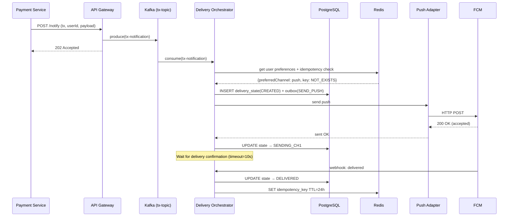
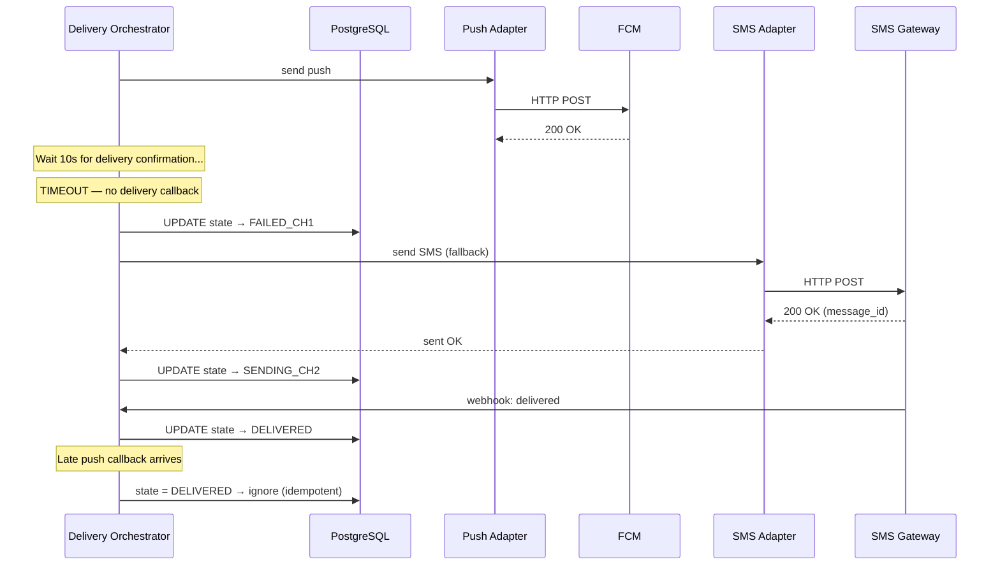
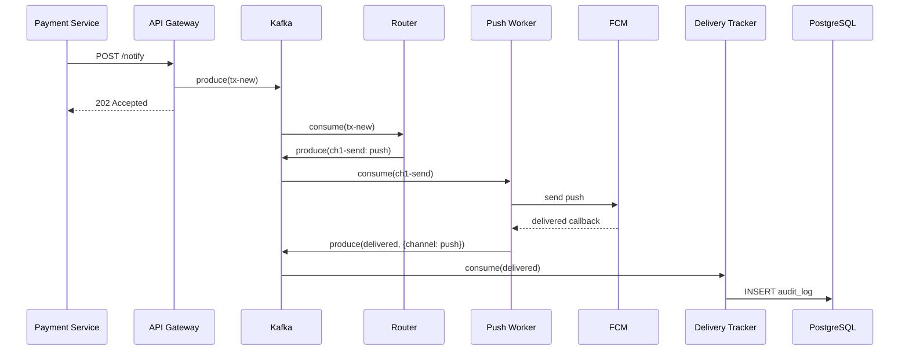
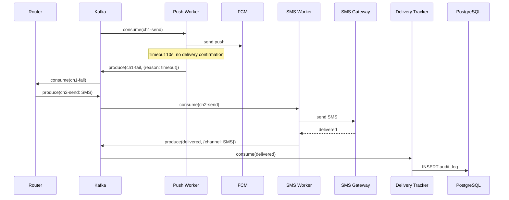

# soa-architecture
## 1. Функциональные требования

| Номер | Требование |
|---|-----------|
| FR1 | Система должна доставлять транзакционные уведомления (списание, перевод, подтверждение операции) через как минимум один из каналов (push, SMS, email) |
| FR2 | Пользователь может управлять настройками уведомлений: выбирать предпочтительный канал и отключать сервисные и маркетинговые уведомления. Транзакционные уведомления нельзя отключить - только сменить канал |
| FR3 | Система должна поддерживать массовые рассылки маркетинговых уведомлений на аудиторию до 1 млн пользователей |
| FR4 | При недоступности основного канала доставки система автоматически переключается на резервный канал без участия пользователя |
| FR5 | Система должна исключать дублирование уведомлений - пользователь не должен получать одно и то же сообщение дваждыr |

---

## 2. Нефункциональные требования

| Номер | Категория | Требование | Метрика |
|---|-----------|-----------|---------|
| NFR1 | Performance | Транзакционные уведомления доставляются пользователю с минимальной задержкой | <= 2 секунд от получения запроса до отправки в провайдер (p99) |
| NFR2 | Throughput | Система обрабатывает пиковую нагрузку маркетинговых рассылок | >= 5 000 уведомлений/сек в пике |
| NFR3 | Availability | Система транзакционных уведомлений является высокодоступной | SLA >= 99.95% |
| NFR4 | Durability | Ни одно принятое транзакционное уведомление не должно быть потеряно | 0 потерь после ACK (at-least-once delivery) |
| NFR5 | Observability | Команда эксплуатации видит состояние системы в реальном времени | Метрики доставки, ошибки, latency по каналам, алерты при деградации |
| NFR6 | Cost-efficiency | Минимизация стоимости доставки | Push предпочтительнее SMS, SMS используется только как fallback |

---

## 3. Архитектурно значимые требования (ASR)

### ASR-1: Низкая задержка доставки транзакционных уведомлений (<= 3 сек)

**Связанные требования:** FR1, NFR1, NFR3

**Почему влияету:** Требует выделенной быстрой очереди для транзакционных уведомлений, отделенной от сервисных и маркетинговых. Запрещает синхронные вызовы с большой latency на критическом пути. Определяет выбор брокера сообщений и модель взаимодействия компонентов (асинхронную например).

### ASR-2: Гарантированная доставка с failover

**Связанные требования:** FR1, FR4, FR5, NFR4

**Почему влияет:** Требует машины состояний доставки для каждого уведомления, персистентного хранения статусов, механизма таймаутов и retry с переключением канала. Необходимо обеспечить идемпотентность, чтобы failover не приводил к дублированию.

### ASR-3: Высокая пропускная способность

**Связанные требования:** FR3, NFR2, NFR6

**Почему влияет на архитектуру:** Требует горизонтального масштабирования всех компонентов на пути обработки, партиционирования очередей, batch-отправки в провайдеры для маркетинговых рассылок. Определяет выбор брокера (Kafka или RabbitMQ).

### ASR-4: Наблюдаемость процесса доставки

**Связанные требования:** NFR5

**Почему влияет на архитектуру:** Требует логгирования и трейсинга, хранения логов доставки. Влияет на выбор инфраструктурных компонентов (Grafana/Jaeger) и формат межсервисного взаимодействия.

---

## 4. Ключевые архитектурные вопросы

### Вопрос 1: Синхронная или асинхронная модель приёма уведомлений от сервисов-источников?

ASR-1 (latency), ASR-3 (throughput)

Синхронная модель проще, но создаёт coupling и не позволяет сглаживать пики. Асинхронная позволяет буферизацию и приоритизацию, но усложняет гарантию доставки и observability.

### Вопрос 2: Единая очередь или раздельные очереди по приоритету/типу уведомлений?

ASR-1 (latency), ASR-3 (throughput)

Единая очередь проще в эксплуатации, но маркетинговая рассылка на 1 млн может заблокировать транзакционные уведомления. Раздельные очереди гарантируют SLA для критичных сообщений, но увеличивают операционную сложность.

### Вопрос 3: Где хранить состояние доставки? В брокере или в отдельной БД?

ASR-2 (гарантированная доставка), ASR-4 (observability)

Хранение в брокере (например в кафке) минимизирует latency, но затрудняет запросы по истории. Отдельная БД даёт гибкость в запросах и аудите, но добавляет задержку на запись.

### Вопрос 4: Как определять момент failover - по таймауту или по callback от провайдера?

ASR-2 (failover), ASR-1 (latency)

Callback точнее, но не все провайдеры дают его быстро. Таймаут проще, но может привести к ложным failover и дублированию.

---

## 5. Архитектурные последствия ASR

### ASR-1: Низкая задержка (<= 2 сек)

- Выделенный приоритетный топик/очередь для транзакционных уведомлений
- Минимальное число хопов на критическом пути 
- Кэширование пользовательских настроек (Redis) вместо синхронного запроса в БД
- Предподключенные пулы соединений к провайдерам

### ASR-2: Гарантированная доставка с failover

- Персистентная стейт машина доставки (pending, sent, delivered)
- sequence number для каждого уведомления для предотвращения дублей
- ретраи с exponential backoff
- Outbox pattern для атомарной записи состояния + отправки события
- Dead Letter Queue для уведомлений, не доставленных ни через один канал

### ASR-3: Высокая пропускная способность

- Kafka с партиционированием по user_id
- Горизонтальное масштабирование stateless-воркеров
- Rate limiter на исходящие запросы к провайдерам

### ASR-4: Наблюдаемость

- Логи
- Метрики (delivery rate, latency, failure rate по каналам) -> Prometheus и Grafana
- Трейсинг -> Jaeger
- Сохранение логов в PostgreSQL для поддержки и истории доставки

---

## 6. Архитектурные решения, которые НЕ подходят

### Решение 1: Единая очередь FIFO для всех типов уведомлений

Нарушается ASR-1 (низкая задержка), ASR-3 (throughput)

Маркетинговая рассылка на 1 млн пользователей создаёт очередь из примерно 5 млн сообщений (с учетом каналов). Транзакционное уведомление, попавшее за ними, будет ждать минуты или часы, нарушая SLA в 3 секунды. Приоритетные очереди в RabbitMQ частично решают проблему, но не масштабируются. Нужны физически раздельные очереди/топики.

### Решение 2: Синхронная отправка через все каналы одновременно (fan-out) для гарантии доставки

ASR-2 (предотвращение дублирования), NFR6 (cost-efficiency)

Отправка push + SMS + email одновременно почти наверное гарантирует доставку, но пользователь получает 3 одинаковых уведомления.

---

## 7. Неопределённости и архитектурные риски

### Неопределённость 1: Реальная надежность и latency провайдеров push/SMS/email

**Что неизвестно:** Какой процент push-уведомлений реально доставляется? Какой средний и p99 latency у провайдеров? С какого момента провайдеры начинают отдавать 429?

**Как проверить:** Провести тесты с реальным трафиком, собирая delivery rate, latency p50/p95/p99, и downtime каждого провайдера. На основе данных калибровать таймауты failover.

### Неопределённость 2: Паттерн нагрузки маркетинговых рассылок

**Что неизвестно:** Как часто маркетинг отправляет массовые рассылки? Совпадают ли они с пиками транзакционной активности (например, вечером или на праздниках)?

**Как проверить:** Собрать историю рассылок за 3 месяца у маркетинговой команды, наложить на график транзакционной нагрузки.

### Неопределённость 3: Наличие delivery callback у всех провайдеров

**Что неизвестно:** Все ли текущие провайдеры поддерживают callback о статусе доставки? С какой задержкой?

**Как проверить:** Провести ревизию API каждого провайдера, зафиксировать доступные механизмы подтверждения доставки. Для провайдеров без callback — предусмотреть timeout-based fallback.

---

## 8. RFC: Гарантированная доставка критичных уведомлений с кросс-канальным failover

---

# RFC: Проектирование механизма гарантированной доставки критичных уведомлений с кросс-канальным failover

| Метаданные | Значение |
|------------|----------|
| **Статус** | DRAFT |
| **Автор(ы)** | Замятин Матвей |
| **Дата создания** | 2026-04-06 |
| **Дата обновления** | 2026-04-07 |

---

## Оглавление

1. [Контекст](#контекст)
2. [Продуктовый анализ](#продуктовый-анализ)
3. [Пользовательские сценарии](#пользовательские-сценарии)
4. [Статистика](#статистика)
5. [Требования](#требования)
6. [Варианты решения](#варианты-решения)
7. [Сравнительный анализ](#сравнительный-анализ)
8. [Выводы](#выводы)
9. [Связанные задачи](#связанные-задачи)

---

## Контекст

Транзакционные уведомления критичны для пользовательского опыта. Сейчас команды отправляют уведомления самостоятельно через разных провайдеров — нет единого механизма failover, нет гарантии доставки, нет защиты от дублей.

Необходимо спроектировать подсистему в рамках Notification Platform, которая гарантирует доставку критичного уведомления хотя бы через один канал с автоматическим переключением при отказе.

### Ключевые вопросы
- Как гарантировать доставку при нестабильности провайдеров?
- Как переключаться на резервный канал без дублирования?
- Как минимизировать стоимость (push дешевле SMS)?

---

## Пользовательские сценарии

| Приоритет | Сценарий |
|-----------|----------|
| MUST HAVE | Пользователь совершает перевод -> получает push-уведомление в течение 2 секунд |
| MUST HAVE | Push не доставлен -> система автоматически отправляет SMS через 10 секунд |
| MUST HAVE | SMS-провайдер недоступен -> система отправляет email как последний канал |
| MUST HAVE | При failover push -> SMS пользователь получает уведомление только через SMS, не через оба канала |
| SHOULD HAVE | Пользователь выбирает предпочтительный канал (например, SMS первый) - система учитывает это при выборе порядка каналов |
| SHOULD HAVE | Оператор поддержки видит полную цепочку попыток доставки конкретного уведомления |

---

## Статистика и расчёт нагрузки

**Пользователи:**
- MAU: 10 млн, DAU: 3 млн, Peak Concurrent: 300000

**Транзакционные уведомления (только они в скоупе RFC):**
- Среднее: 2 на пользователя/день
- Daily volume: 3 млн * 2 = **6 млн уведомлений/день**
- Средний RPS: 6 000 000 / 86 400 ≈ **70 RPS**
- Пиковый RPS (5x от среднего, зарплатные дни, вечер): ~350 RPS
- С учётом failover-retry (10% уведомлений -> второй канал): ~385 RPS пик

**Общий объём всех уведомлений (для понимания контекста платформы):**
- 3 млн * 10 = 30 млн/день -> 350 RPS среднее, ~1 750 RPS пик
- Маркетинговые рассылки: до 1 млн за кампанию

**Хранение:**
- Запись delivery state: ~500 байт * 6 млн/день = ~3 ГБ/день, ~90 ГБ/месяц
- Retention лога для аудита: 90 дней -> ~270 ГБ

---

## Требования

### Функциональные требования

| Номер | Приоритет | Обозначение | Требование |
|---|-----------|-----|-----------|
| 1 | MUST HAVE | FR1 | Система гарантирует доставку транзакционного уведомления хотя бы через один канал |
| 2 | MUST HAVE | FR2 | При неуспешной доставке через основной канал система автоматически переключается на следующий канал из цепочки (push -> SMS -> email) |
| 3 | MUST HAVE | FR3 | Система предотвращает дублирование уведомлений при failover |
| 4 | MUST HAVE | FR4 | Транзакционные уведомления нельзя отключить, пользователь может только выбрать предпочтительный канал |
| 5 | SHOULD HAVE | FR5 | Система учитывает пользовательские настройки предпочтительного канала при формировании цепочки failover |
| 6 | SHOULD HAVE | FR6 | Система сохраняет полный лог каждой попытки доставки |
| 7 | MUST HAVE | FR7 | Система выбирает наиболее дешёвый канал первым (push -> SMS -> email) с учётом пользовательских настроек |

### Нефункциональные требования

| Номер | Приоритет | Обозначение | Требование |
|---|-----------|-----|-----------|
| 1 | MUST HAVE | NFR1 | Latency доставки в первый канал <= 3 сек (p99) |
| 2 | MUST HAVE | NFR2 | Полный цикл failover (все 3 канала) завершается за <= 60 сек |
| 3 | MUST HAVE | NFR3 | Availability подсистемы >= 99.95% |
| 4 | MUST HAVE | NFR4 | 0 потерянных уведомлений после приёма (at-least-once + idempotency) |
| 5 | MUST HAVE | NFR5 | Пропускная способность >= 500 RPS транзакционных уведомлений |
| 6 | SHOULD HAVE | NFR6 | Метрики delivery rate, latency, failure rate доступны в реальном времени с задержкой <= 30 сек |

### ASR (с приоритетами)

| Приоритет | ASR | Связанные требования |
|-----------|-----|---------------------|
| P0 | Гарантированная доставка с failover без дублей | FR1, FR2, FR3, NFR4 |
| P0 | Latency <= 3 сек для первого канала | FR1, NFR1 |
| P1 | Горизонтальная масштабируемость до 500+ RPS | NFR5 |
| P1 | Observability полного цикла доставки | FR6, NFR6 |
| P2 | Минимизация стоимости (push-first) | FR7 |

---

## Варианты решения

### Вариант 1: Orchestrator-based (Центральный оркестратор с FSM)

> **Описание:** Выделенный сервис Delivery Orchestrator управляет машиной состояний каждого уведомления. Он последовательно пытается использовать каналы, ожидая подтверждения, и переключается при неудаче. Состояние хранится в PostgreSQL (outbox pattern).

#### Архитектура

```
┌─────────────────────────────────────────────────────────────────┐
│                    Notification Platform                        │
│                                                                 │
│  ┌──────────┐    ┌───────────┐    ┌──────────────────────┐      │
│  │ API      │───▶│  Kafka    │───▶│ Delivery Orchestrator│      │
│  │ Gateway  │    │ (tx topic)│    │ (FSM + Outbox)       │      │
│  └──────────┘    └───────────┘    └──────┬───────────────┘      │
│                                          │                      │
│                              ┌───────────┼───────────┐          │
│                              ▼           ▼           ▼          │
│                         ┌────────┐ ┌─────────┐ ┌─────────┐      │
│                         │ Push   │ │  SMS    │ │  Email  │      │
│                         │Adapter │ │ Adapter │ │ Adapter │      │
│                         └───┬────┘ └────┬────┘ └────┬────┘      │
│                             │           │           │           │
│  ┌───────────┐    ┌─────────┴───────────┴───────────┘           │
│  │PostgreSQL │    │                                             │
│  │(state +   │    ▼                                             │
│  │ outbox)   │  External Providers (FCM, SMS gateway, SMTP)     │
│  └───────────┘                                                  │
│  ┌───────────┐   ┌──────────────┐                               │
│  │  Redis    │   │ Callback     │<-- Provider webhooks          │
│  │ (cache)   │   │ Handler      │                               │
│  └───────────┘   └──────────────┘                               │
└─────────────────────────────────────────────────────────────────┘
```

#### Компоненты

- **API Gateway** — принимает запросы от сервисов-источников, валидирует, пишет в Kafka
- **Kafka (tx-notifications topic)** — буфер с гарантией at-least-once, партиционирование по user_id
- **Delivery Orchestrator** — читает из Kafka, загружает настройки пользователя из Redis, ведёт FSM в PostgreSQL (outbox pattern), отправляет команды в channel adapters
- **Channel Adapters (Push/SMS/Email)** — абстракция над провайдерами; преобразуют внутренний формат в формат провайдера
- **Callback Handler** — принимает webhook'и от провайдеров, обновляет статус в PostgreSQL, публикует событие в Kafka
- **PostgreSQL** — хранит delivery state, outbox, аудит-лог
- **Redis** — кэш пользовательских настроек

#### Машина состояний (FSM)

```
CREATED → SENDING_CH1 → DELIVERED (done)
                      → FAILED_CH1 → SENDING_CH2 → DELIVERED (done)
                                                  → FAILED_CH2 → SENDING_CH3 → DELIVERED (done)
                                                                              → FAILED_ALL → DLQ
```

#### Sequence Diagram — основной сценарий (успешный push)



#### Sequence Diagram — failover (push failed -> SMS)



#### Как решение удовлетворяет ASR

| ASR | Как выполняется |
|-----|----------------|
| Гарантированная доставка | FSM + outbox pattern: каждый переход атомарен, при падении Orchestrator перечитывает outbox |
| Без дублей | Уникальный ключ в Redis; FSM проверяет текущее состояние перед действием |
| Latency <= 3 сек | Kafka consumer lag < 100ms, Redis cache для настроек, прямая отправка в провайдер |
| Масштабируемость | Kafka partitions и Orchestrator replicas, партициониерование по user_id |
| Observability | Каждый переход FSM пишется в PostgreSQL + structured log + Prometheus counter |

#### Технологии

- Kafka
- PostgreSQL 18 (primary + synchronous replica)
- Redis Cluster (3 masters + 3 replicas) - cache + idempotency
- Rust для Orchestrator
- Prometheus + Grafana + Jaeger

#### Преимущества
- Полный контроль над FSM - легко добавлять каналы, менять логику retry
- Простая отладка: состояние каждого уведомления в PostgreSQL
- Outbox pattern обеспечивает consistency между БД и Kafka

#### Недостатки
- PostgreSQL — потенциальное узкое место при высокой нагрузке
- Orchestrator содержит все состояние и привязывается к партциям, усложняет деплой
- Задержка добавлена записью в постгресе на критическом пути (~2-5ms)

---

### Вариант 2: Choreography-based (Event-driven через Kafka без центрального оркестратора)

> **Описание:** Нет центрального оркестратора. Каждый Channel Adapter — самостоятельный consumer. При неудаче adapter публикует событие delivery_failed в Kafka, и следующий adapter в цепочке подхватывает его. Состояние восстанавливается из потока событий.

#### Архитектура (C4 Container)

```
┌──────────────────────────────────────────────────────────────────┐
│                    Notification Platform                         │
│                                                                  │
│  ┌──────────┐    ┌───────────┐                                   │
│  │ API      │───▶│  Kafka    │                                   │
│  │ Gateway  │    │           │                                   │
│  └──────────┘    │ Topics:   │                                   │
│                  │ • tx-new  │                                   │
│                  │ • ch1-send│──▶ ┌───────────┐                  │
│                  │ • ch1-fail│    │Push Worker│                  │
│                  │ • ch2-send│──▶ ┌───────────┐                  │
│                  │ • ch2-fail│    │SMS Worker │                  │
│                  │ • ch3-send│──▶ ┌───────────┐                  │
│                  │ • deliver │    │Email Wrkr │                  │
│                  │ • dlq     │    └───────────┘                  │
│                  └───────────┘                                   │
│                                                                  │
│  ┌───────────┐  ┌───────────────┐  ┌──────────────────┐          │
│  │  Redis    │  │ Router        │  │ Delivery         │          │
│  │           │  │ (tx-new →     │  │ Tracker          │          │
│  │           │  │  ch1-send)    │  │ (consume all     │          │
│  └───────────┘  └───────────────┘  │  events → DB)    │          │
│                                    └──────────────────┘          │
│                                     ┌─────────────────┐          │
│                                     │ PostgreSQL      │          │
│                                     │ (audit log only)│          │
│                                     └─────────────────┘          │
└──────────────────────────────────────────────────────────────────┘
```

#### Поток событий

1. API Gateway → `tx-new` topic
2. **Router** читает `tx-new`, определяет первый канал по настройкам пользователя, пишет в `ch1-send`
3. **Push Worker** читает `ch1-send`, отправляет push. Если успех -> пишет в `delivered`. Если неуспех/таймаут -> пишет в `ch1-fail`
4. **Router** читает `ch1-fail`, пишет в `ch2-send`
5. **SMS Worker** читает `ch2-send` и так далее
6. **Delivery Tracker** (отдельный consumer) читает все топики, материализует состояние в PostgreSQL для запросов и аудита

#### Sequence Diagram — основной сценарий




#### Sequence Diagram — failover



#### Как решение удовлетворяет ASR

| ASR | Как выполняется |
|-----|----------------|
| Гарантированная доставка | Kafka at-least-once + цепочка топиков обеспечивает прохождение всех каналов |
| Без дублей | Redis idempotency key проверяется каждым worker перед отправкой, `deliver` event останавливает цепочку |
| Latency <= 3 сек | Нет записи в БД на критическом пути, Kafka -> Worker -> Provider напрямую |
| Масштабируемость | Каждый worker масштабируется независимо, Router stateless |
| Observability | Delivery Tracker материализует полную картину из event stream |

#### Технологии

- Kafka
- Redis Cluster
- PostgreSQL — только логи (не на критическом пути)
- Go для workers
- Prometheus + Grafana + Jaeger

#### Преимущества
- Нет БД на критическом пути
- Каждый worker независим - простое масштабирование и деплой
- При падении worker'а Kafka автоматически ребалансирует partitions

#### Недостатки
- Сложнее отладка: состояние распределено по топикам Kafka, нет единого источника правды в реальном времени
- Больше топиков -Ю больше операционная сложность Kafka
- Остановить цепочку failover при позднем delivery callback сложнее
- Таймауты реализуются через delayed retry в worker'ах, что менее гибко чем FSM

---

## Сравнительный анализ

### Ресурсные требования

| Критерий | Вариант 1 (Orchestrator) | Вариант 2 (Choreography) |
|----------|------------------------|------------------------|
| Время реализации | 10–12 недель | 8–10 недель |
| Сложность кода | Высокая (FSM, outbox) | Средняя (stateless workers) |
| Инфраструктура | Kafka + PostgreSQL (синхр. реплика) + Redis | Kafka (больше топиков) + Redis + PostgreSQL (только аудит) |
| Операционная сложность | Средняя (меньше компонентов, но stateful orchestrator) | Средняя (больше топиков, но stateless workers) |

### Соответствие требованиям

| Требование | Вариант 1 | Вариант 2 |
|------------|-----------|-----------|
| FR1 (гарантия доставки) | FSM + outbox | Event chain |
| FR2 (автоматический failover) | FSM переходы | Kafka topic chain |
| FR3 (без дублей) | FSM state check + idempotency | Redis idempotency (менее строго) |
| NFR1 (latency <= 3 сек) | ~5ms overhead от PG write | нет бд на критическом пути |
| NFR3 (availability 99.95%) | PG synchronous replica | Kafka replication |
| NFR4 (0 потерь) | Outbox pattern | Kafka at-least-once |
| NFR6 (observability) | PG = source of truth | Eventual (небольшой лаг в консьмерах) |

---

## Выводы

**Рекомендация: Вариант 1 (Orchestrator-based с FSM)**

**Обоснование:**

Для банковской системы, где критично не потерять ни одно транзакционное уведомление и не отправить дубль, предсказуемость важнее минимальной разницы в latency. Вариант 1 предоставляет единый источник правды (PostgreSQL) для состояния каждого уведомления, что упрощает отладку, аудит и расследование инцидентов. Outbox pattern гарантирует consistency между состоянием и событиями.

Overhead от записи в PostgreSQL (~2-5ms) не нарушает SLA в 3 секунды и является приемлемым компромиссом за строгую гарантию consistency. При достижении пределов PostgreSQL можно перейти на партиционирование таблицы по дате или sharding по user_id.

**Ключевые компромиссы:**
- Принимаем +2-5ms latency ради consistency и простоты отладки
- PostgreSQL — потенциальное узкое место, но при ~385 RPS это ~385 INSERT/сек, что мало для PostgreSQL
- Orchestrator stateful — требует партиционирования, но Kafka consumer groups решают это

**Ограничения решения:**
- При росте нагрузки выше ~5 000 RPS потребуется шардинг PostgreSQL или переход на Cassandra для delivery state
- Решение оптимизировано для транзакционных уведомлений, маркетинговые и сервисные требуют отдельного пайплайна
- Зависимость от delivery callback провайдеров: если callback запаздывает, возможен ложный failover

---

## Глоссарий

| Термин | Определение |
|--------|-------------|
| FSM | Finite State Machine — конечный автомат состояний доставки |
| Outbox pattern | Паттерн, при котором событие записывается в таблицу outbox в одной транзакции с изменением состояния, а затем публикуется в брокер |
| Idempotency key | Уникальный ключ уведомления, предотвращающий повторную отправку |
| DLQ | Dead Letter Queue — очередь для уведомлений, которые не удалось доставить ни через один канал |
| FCM | Firebase Cloud Messaging — сервис push-уведомлений Google |
| Channel Adapter | Компонент-абстракция над конкретным провайдером доставки |
